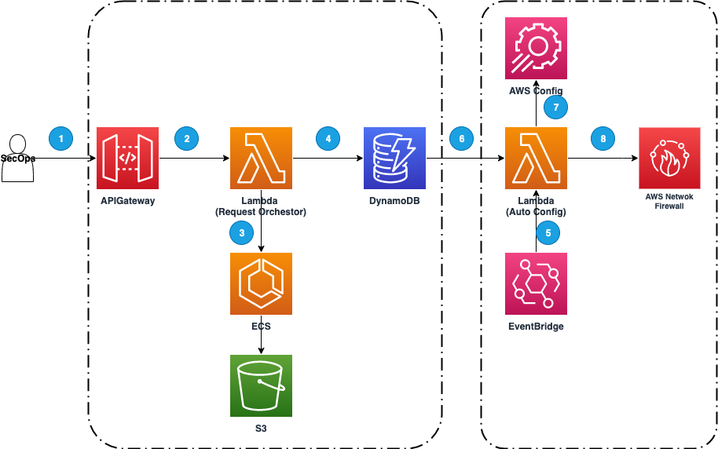

# dynamic-object-and-rule-extensions-for-anfw

[](https://github.com/aws-solutions/dynamic-object-and-rule-extensions-for-anfw/actions/workflows/node.js.yml)
[](https://github.com/aws-solutions/dynamic-object-and-rule-extensions-for-anfw/issues)
[](https://github.com/aws-solutions/dynamic-object-and-rule-extensions-for-anfw/issues)
[](https://github.com/aws-solutions/dynamic-object-and-rule-extensions-for-anfw/pulls)
[](https://github.com/aws-solutions/dynamic-object-and-rule-extensions-for-anfw/releases)
[](https://opensource.org/licenses/Apache-2.0)

Dynamic Object and Rule Extensions for AWS Network Firewall enables customers to define objects that reference cloud native elastic resources, and to create AWS Network Firewall rules based on these custom objects. The solution continually synchronises the customers AWS Network Firewall (ANFW) instance with the state of the referenced elastic resources, to keep it up to date in near real-time.

The solution provides a RESTful interface with CRUD APIs for managing rule bundles, rules and objects.

---

## Architecture Overview


_Request Orchestration_

1. The API gateway provides the primary interface for the customer to interact with this solution, including endpoints to manage the domain entities include Rule/Object/RuleBundle, as well as list Audit info. Please refer to implementation guide Appendix C: API schema and sample requests for information on updating the Metadata.
2. Request is forwarded to the Lambda function which coordinates the handling of the request.
3. _Optional_ - based on configuration value enableOpa. When enableOpa=ture, Lambda triggers ECS-hosted OPA cluster to exercise validation on the request based on context, e.g, is the requester allowed to perform the Create Object action?
4. Lambda issues request data from DynamoDB to read from or write to domain entity tables

_Automatic resource ↔ rule synchronisation and ANFW configuration_

1. An Amazon EventBridge rule is scheduled to invoke the “Auto Config” Lambda function, the frequency is based on the configuration `ruleResolutionInterval` default value 10 minutes.
2. Auto config Lambda function requests domain entity data such as RuleBundle , Rule and Object from Amazon DynamoDB
3. Auto Config Lambda function queries the AWS Config Aggregator to resolve defined Object referenced by Rule in the solution
4. Auto Config Lambda function sends an update request to AWS Network Firewall

---

## File Structure

Upon successfully cloning the repository into your local development environment but **prior** to running the initialization script, you will see the following file structure in your editor:

```
├── CHANGELOG.md             [Change log file]
├── CODE_OF_CONDUCT.md       [Code of conduct file]
├── CONTRIBUTING.md          [Contribution guide]
├── LICENSE.txt              [LICENSE for this solution]
├── NOTICE.txt               [Notice for 3rd-party libraries]
├── README.md                [Read me file]
├── buildspec.yml
├── deployment
│   ├── build-open-source-dist.sh            [ shell script for packaging distribution assets ]
│   ├── build-s3-dist.sh                     [ shell script for packaging distribution assets ]
├── deployment-prerequisties
│   ├── cross-account-role-anfw-stack.yaml   [ support stack for creating cross account role]
│   └── cross-account-role-config-stack.yaml [ support stack for creating cross account role]
├── scripts
│   └── aoe.sh                                [ shell script for accessing solution's api ]
├── sonar-project.properties
└── source                                    [ solution's source code, see more detail in [here](source/README.MD) ]
    ├── LicenseHeader.txt
    ├── README.md
    ├── bin
    ├── cdk.json
    ├── ecs_sidecar
    ├── images
    ├── integration-tests
    ├── jest.config.js
    ├── lambda
    ├── lib
    ├── opa
    ├── package-lock.json
    ├── package.json
    ├── run-all-tests.sh
    ├── test
    └── tsconfig.json

```

## Prerequisite

- The latest version of the AWS CLI (2.2.37 or newer), installed and configured.
  - https://aws.amazon.com/cli/
- The latest version of the AWS CDK (1.139.0 or newer).
  - https://docs.aws.amazon.com/cdk/latest/guide/home.html
  - Bootstrap target account https://docs.aws.amazon.com/cdk/v2/guide/bootstrapping.html
- Make 3.5.0 +
- Docker 19.0.0 +. (required when enableOpa set to true)
  - https://docs.docker.com/get-docker/
- A CDK bootstrapped AWS account.
  - https://docs.aws.amazon.com/cdk/latest/guide/bootstrapping.html
- nodejs version 14
  - https://docs.npmjs.com/getting-started
- cli tools zip tar gzip

## Configuration

| Configuration                                | Description                                                                                                                                                          | Default value                                                                         | Value type                         |
| -------------------------------------------- | -------------------------------------------------------------------------------------------------------------------------------------------------------------------- | ------------------------------------------------------------------------------------- | ---------------------------------- |
| networkFirewallRuleGroupNamePattern          | Allowed Network Firewall rule group pattern                                                                                                                          | default-anfwconfig-rule-\*                                                            | string                             |
| defaultAggregatorName                        | AWS Config aggregator name used by this solution, when creating a new rule group. If no aggregator is provided, defaultAggregator will be assigned to the rule group | org-replicator                                                                        | string                             |
| ruleResolutionInterval                       | The interval rules are resolved and applied into Network Firewall                                                                                                    | 10 mins                                                                               | integer, min value 5, max value 60 |
| failureNotificationTargetEmails              | The email addresses for sending notifications. Once rule resolution failure happens, customer can add their email to the SNS topic manually later on                 | []                                                                                    | list of strings                    |
| apiGatewayType                               | The type of API gateway                                                                                                                                              | private                                                                               | edge \| private                    |
| enableOpa\*                                  | (OPA specific configuration) Enable OPA cluster to validate rule and object mutation requests                                                                        | false                                                                                 | true \| false                      |
| certificateArn\*                             | (OPA specific configuration) ACM certification for the ALB used when enableOpa is set to true                                                                        |
| crossAccountConfigReadOnlyRole\*\*           | AWS IAM read-only role in the account in which the AWS config is activated                                                                                           | NULL, target at solution installation account                                         | string                             |
| crossAccountNetworkFirewallReadWriteRole\*\* | AWS IAM read/write role account in which the AWS network firewall instance is setup                                                                                  | NULL, target at solution installation account                                         | string                             |
| objectExtensionSecOpsAdminRole\*\*           | Customer specified AWS IAM role in solution account which to be used to access solution API                                                                          | arn:aws:iam::<solution-account>:role/ObjectExtensionSecOpsAdminRole-<solution-region> | ARN                                |

## Running Unit Tests

The `/source/run-all-tests.sh` script is the centralized script for running all unit, integration, and snapshot tests for both the CDK project as well as any associated Lambda functions or other source code packages.

```
cd ./deployment
chmod +x ./run-unit-tests.sh
./run-unit-tests.sh
```

---

## API schema and examples

### API schema document

1. generate api doc `cd source; npm run doc:firewall-config-api`
2. the api document is located in [source/lambda/firewall-config-api/doc/index.html](source/lambda/firewall-config-api/doc/index.html)

### API usage example

see more in [API-Usage-example.md](source/doc/API-Usage-example.md)

## Building and Deploy the solution

1. Clone the solution source code from its GitHub repository.
2. Open the terminal and navigate to the folder created in step 1.
3. Navigate to the source folder
4. Run npm run install:all
5. Run npm run all
6. Run cdk synth

   1. cdk synth
   2. (optional, for customize configuration value ) cdk synth -c <Configuration> <Value>
      e.g to override ruleResolutionInterval run cdk synth -c ruleResolutionInterval 5 this would set the ruleResolutionInterval from default 10 minutes to 5 minutes

7. Run cdk deploy
   1. Ensure docker daemon is running (if OPA is enabled)
   2. cdk boot strap is completed for the deployment account

---

## Uninstall the solution

The solution can be uninstalled by either

- Run cdk destroy from the sources folder.
  - cdk destroy
- Delete the stack from the CloudFormation console.
  - Go to AWS web console 'CloudFormation' and find stack `FirewallObjectExtensionSolutionStack`, click Delete
  - The cross account access stacks will also need to be deleted from this method

Notice for data retention and audit purpose the following 2 types of resource will not be removed:

- OPA policy bucket and its encryption key in KMS
- All 4 domain data DynamoDB tables (includes table for RuleBundle, Rule, Object and Audit) and their encryption keys in KMS

## Collection of operational metrics

This solution collects anonymous operational metrics to help AWS improve the quality and features of the solution. For more information, including how to disable this capability, refer to the [collection of operational metrics](https://docs.aws.amazon.com/solutions/latest/dynamic-object-and-rule-extensions-for-aws-network-firewall/collection-of-operational-metrics.html) section in the implementation guide.

---

Copyright Amazon.com, Inc. or its affiliates. All Rights Reserved.

Licensed under the Apache License Version 2.0 (the "License"). You may not use this file except in compliance with the License. A copy of the License is located at

    http://www.apache.org/licenses/

or in the "license" file accompanying this file. This file is distributed on an "AS IS" BASIS, WITHOUT WARRANTIES OR CONDITIONS OF ANY KIND, express or implied. See the License for the specific language governing permissions and limitations under the License.
